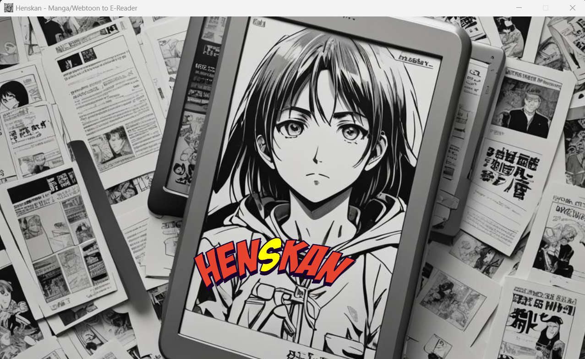
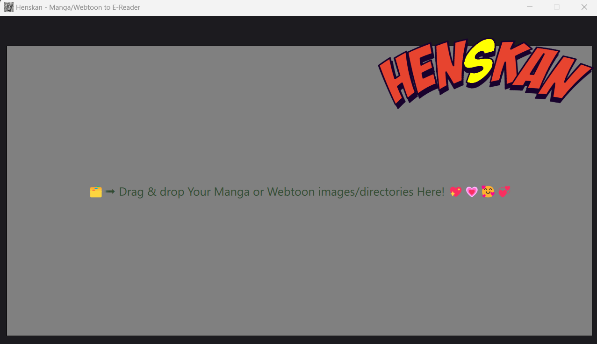
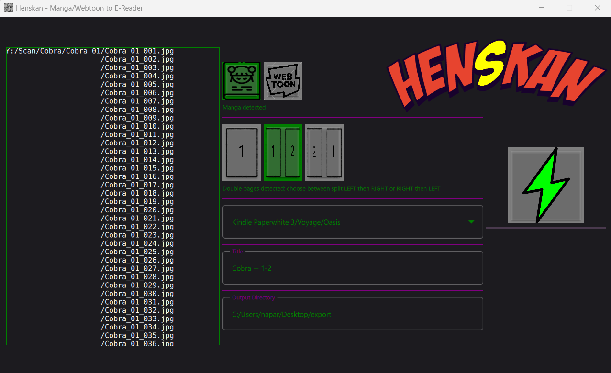
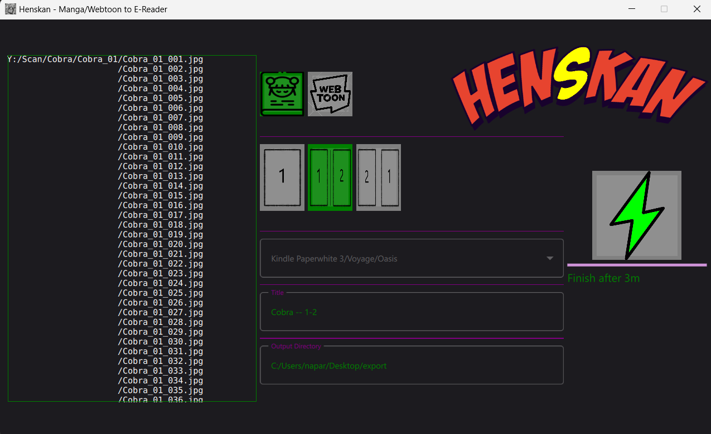
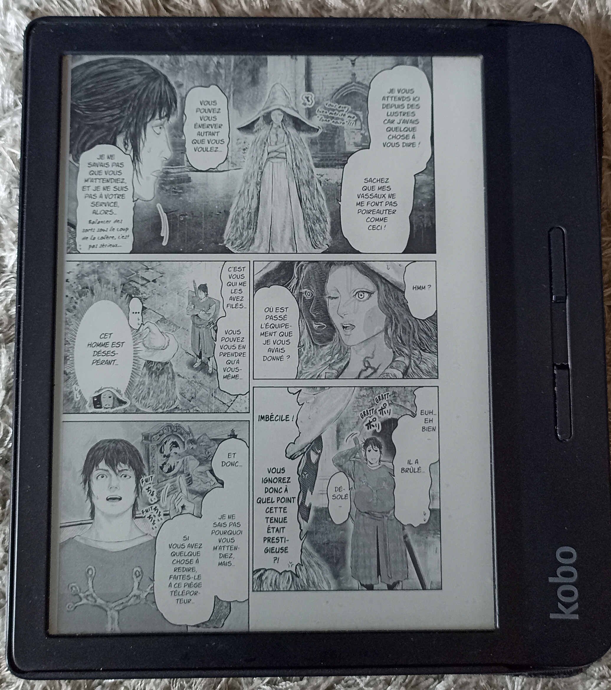

# Henskan #

Henskan is a image converter and optimizer built for reading Manga on the Amazon Kindle and other E-ink (like Kobo)
devices written in Python. With this application you can easily:

*   Load & sort images from directories
*   Split if need (double page scans), convert to grayscale to save space and improve contrast.
*   Manga:
  * *  Automatically enhance your image by removing useless white border, so making scan bigger on e-reader.
  * *  Automatically rotate images if needed.
*   Webtoon:
  * *  Automatically smart split the vertical images into pages that are readable on e-reader

It is based on the previous project [Mangle](https://github.com/FooSoft/mangle), which is no longer maintained.

## Motivation ##

I tried [KCC](https://github.com/ciromattia/kcc) and [Mangle](https://github.com/FooSoft/mangle), and found that Mangle was 
far easier and efficient to use than KCC.

After provide some patchs and features to Mangle, this project was archived by its author. So I decided to fork it and
continue the development as Henskan (based on the word "Henkan" which means "conversion" in Japanese).

I simplify a lof the UI, remove some features that I don't use, and add some new ones. I also try to make the code more
readable and maintainable. I added a lot of feature to auto-detect manga/webtoon, and also to auto-enhance the images based on their colors/greyscale,
and detect the name automatically.

Note that Kindle output (pdf) will also have automatically generated table of content (there is no such feature in the CBZ format for Kobo).

## Usage ##

1.  Just drag & drop you Manga/Webtoon directory on the application.
2.  Check if the autodetections are ok: split or not, manga/webtoon name detected, etc
3.  Select your E-reader model (Kindle or Kobo)
3.  Select the export directory if you want to change
5.  Export your images
6.  Enjoy your Manga :)

## Requirements ##

For running from source:

*   [PyQt6](https://riverbankcomputing.com/software/pyqt/download)
*   [Python 3](http://www.python.org/download/releases/)
*   [Pillow (PIL)](https://pypi.org/project/Pillow/)
*   [ReportLab](https://pypi.org/project/reportlab/)

## Installation ##

Just download the latest release from the [releases page](https://github.com/naparuba/henskan/releases) and run it.

## Logo:
Generated with https://fontmeme.com/fonts/badaboom-bb-font/ & gimp

## Screenshots ##

## On the E-reader ##

## License ##

This program is free software: you can redistribute it and/or modify
it under the terms of the GNU General Public License as published by
the Free Software Foundation, either version 3 of the License, or
(at your option) any later version.

This program is distributed in the hope that it will be useful,
but WITHOUT ANY WARRANTY; without even the implied warranty of
MERCHANTABILITY or FITNESS FOR A PARTICULAR PURPOSE.  See the
GNU General Public License for more details.

You should have received a copy of the GNU General Public License
along with this program.  If not, see <http://www.gnu.org/licenses/>.

## TODO  ##

* finish the PDF for Kobo (and bench it)
* try and help user on the webtoon directory, and image cleaning
* show in the readme how the smart cut is done